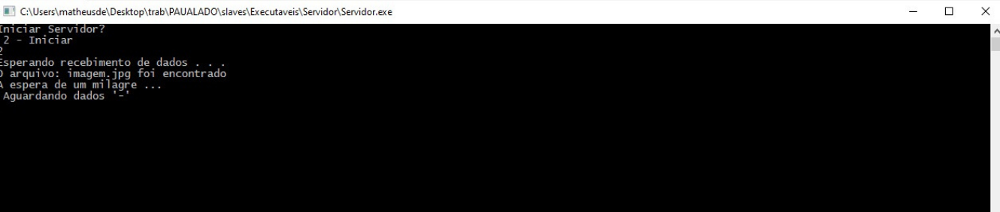
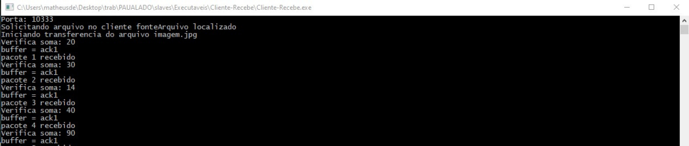
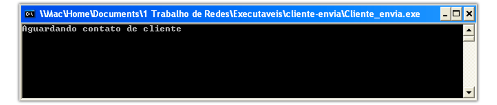
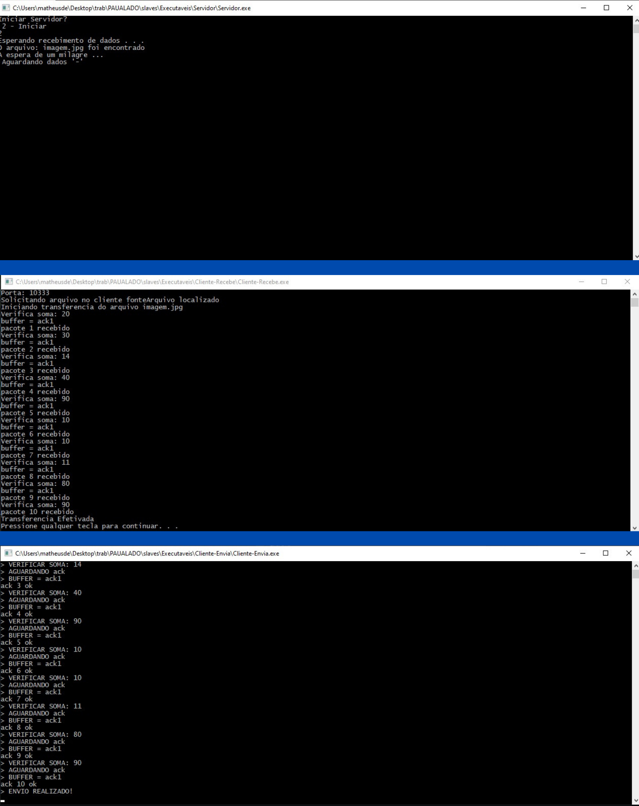

## :closed_book: Versão
1.0.0

## :information_source: Disponibilizado em
Julho de 2021

## :construction_worker: Desenvolvido Por
```
João Lucas Ribeiro, curso de Sistemas de informação
-> Email: ribeirojoaolucas68@gmail.com
	
Matheus de Souza, curso de Sistemas de informação
-> Email: matheussouza18@live.com

Rodrigo Duarte Silva Luz, curso de Sistemas de informação
-> Email: rodrigodsluz@gmail.com

Robson de Arruda Silva, curso de Sistemas de informação
-> Email: robsondearruda1999@gmail.com

```

> Itajubá - MG
>>Universidade Federal de Itajubá - UNIFEI

<div align="center">
   <p><b>Vamos às informações importantes!</b></p>  
</div>   
   


## 🔖 O TRANSFERIDOR UDP® é composto por 3 executáveis, listados abaixo
* Cliente-Envia.exe
* CLiente-Recebe.exe
* Servidor.exe

## :information_source: Como surgiu o Transferidor UDP® ?

Com o intuito de realizar um estudo sobre a transferência de arquivos entre diferentes hosts, surge o **Transferidor UDP®** , que contém 3 programas em Linguagem C que viabilizam a possibilidade de transferir arquivos entre  hosts distintos, ainda que esteja sendo utilizada a mesma máquina no exemplo e na compilação padrão.

* USA o protocolo UDP 

* Garante a integridade e a entrega dos pacotes através da soma de verificação, temporizadores, número de sequência e pacotes de reconhecimento.

> :book: Como é um estudo, sinta-se à vontade para recompilar e modificar os códigos disponibilizados aqui!

## 💻 Como os arquivos são organizados inicialmente?

> #### Transferidor_UDP
>>Readme
>>>Readme.md

>>>Imagens
>>>>cl_envia.png

>>>>cl_recebe.png
>>>>
>>>>exemplo.png
>>>>
>>>>transferencia.png
>>>>
>>>>serv.png
>>>>
>>>>udp.png
>>>>
>>>>info.png
>>>>
>>>>configuration.png
>>>>udpFinal.png

>>Cliente-Envia
>>>Cliente-Envia.c

>> Cliente-Recebe
>>> Cliente-Recebe.c

>> Servidor
>>> Servidor.c

>> Executáveis
>>>Cliente-Envia
	
>>>>Cliente-Envia.exe

>>>>imagem.jpg

>>>>musica.mp3

>>>>texto.txt

>>>CLiente-Recebe

>>>>Cliente-Recebe.exe

>>>Servidor
>>>>Servidor.exe

>>>>repositorio.bs


## :information_source: Importante saber!


`O Sistema Operacional Suportado é o Microsoft Windows;`

`Os arquivos a serem enviados precisam estar no mesmo diretório que o Cliente-Envia.exe;`

Como a finalidade deste projeto é puramente acadêmica, o IP é como `127.0.0.1`, portanto, os `programas devem ser executados na mesma máquina`;

`O Tamanho do buffer é 1024;`

`A porta já está definida como: 10222;`

`Mudanças podem ser feitas, mas é necessária uma recompilação.`


## :information_source: Configuração do Cliente-Recebe.exe

O `Cliente-Recebe` é responsável por `solicitar a transferência de um arquivo`, buscando pelo nome do mesmo.
	
* A entrada é `somente` o nome do arquivo desejado.

## :information_source: Configuração do Cliente-Envia.exe
O `Cliente_Envia.exe` é responsável por `conter os arquivos requisitados e os enviar`.

>Nota: `Apenas fica em escuta após ter sido iniciado`, aguardando conexão.

* Não recebe `nada` como entrada.

# :information_source: Configuração do Servidor.exe

O `Servidor.exe` é responsável por rastrear quem possui os arquivos desejados.

* Depois de iniciado, irá oferecer duas opções:

| Opção  | Função |
|:------------- |:---------------:|
| 1     | Adicionar dados de um arquivo no repositório |         
| 2     | Continuar sem adicionar novos dados|               


>Nota: Após uma opção ser selecionada, `fica em escuta por um cliente que almeja encontrar um arquivo`.

* Recebe apenas `1` ou `2` como opção de entrada.

***


#### :construction_worker: O que será usado nesse exemplo:
* Cliente-Recebe.exe
* Cliente-Envia.exe
* Servidor.exe
* musica.mp3

*Sistema Operacional: Windows 10 PRO*


**Passos:**

```1º - Servidor.exe já iniciado, sendo "2" a opção escolhida.```



```2º - Cliente-Recebe.exe é iniciado, busca o arquivo pelo nome e, ao recebê-lo, inicia a transferência do arquivo.```



```3º - Cliente-Envia.exe somente deixado em execução.```



```4º - Caso existir o arquivo buscado, a transferência já terá iniciado.```



```5º - Transferência concluída!```


---

